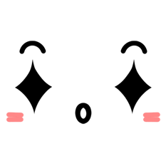
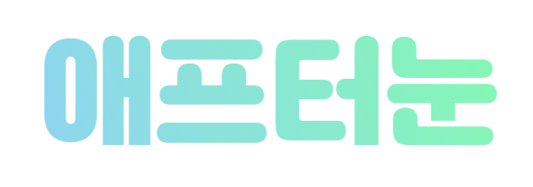
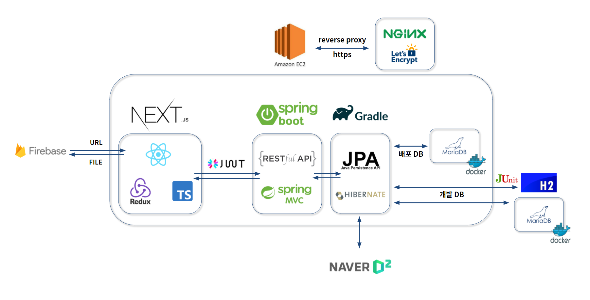

# Welcome to 애프터눈 🙆🙋🙆

- SSAFY 4기 2학기 공통 프로젝트 1위 수상

- [애프터눈 웹사이트](http://i4a302.p.ssafy.io)

  > 본 웹사이트는 SSAFY에서 제공한 AWS EC2 클라우드 서버에서 배포되었습니다. 
  > 접속이 불가한 경우 제공받은 서버가 회수되었음을 알려드립니다.

- 최종발표 전체영상

- 최종발표 시연영상

- 최종발표 UCC

- <a href='docs/애프터눈_발표자료_v4.pdf'>최종발표 PDF</a>

 

## Project Overview 📆

- **진행 기간** : 2021. 01. 11 ~ 2021. 02. 19 (6주)

- **선택 트랙** : 웹 디자인 - 웹 큐레이션 SNS

- **기획 목표** :

  - 소셜커머스의 문제점을 해결할 수 있는 순수한 아이템 공유 SNS 구축

  - 소셜커머스 업체와 입점한 협력업체 사이에서 피해받는 사용자를 위한 서비스 제공

- **서비스명** : 애프터눈

- **슬로건** : 더 나은 당신의 내일을 위해, '애프터눈'

- **로고** : 사진 속 아이템을 바라보는 귀여운 눈

- **서비스 특징**

  - 원하는 아이템 정보를 정리된 태그 안에서 얻을 수 있는 서비스

    - 연관성 높은 정보 제공

  - 부담없이 누구나 나만의 아이템을 공유하는 서비스

    - 누구나 가볍게 작성하고 공유 가능

  - 자유롭게 구매링크를 작성해 서로에게 선택의 폭을 넓혀주는 서비스

    - 구매링크의 다양화로 사용자의 선택지 증가

 

## Tech Stack 🔧

 

## System Architecture 🖥️

## Main Feature ⭐

 

## Who We Are? 👨‍👧‍👦

 
